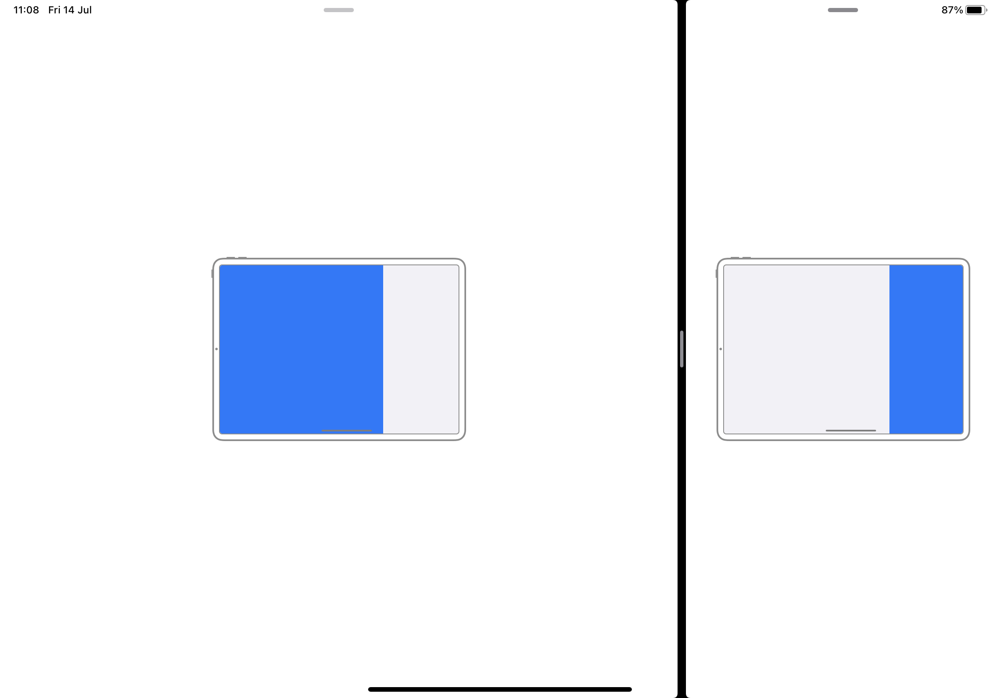

# Absolute Frame Demo

## About
AbsoluteFrameDemo - demo application shows how you can use `AppAbsoluteFrame` module in an application.
The Application subscribes to frame change and then using `AppAbsoluteFrame` calculates and shows on screen mode and ocupation of screen by the app.

## AppAbsoluteFrame
[AppAbsoluteFrame](https://misha2g@bitbucket.org/misha2g/appabsoluteframe.git). Documentation: read readme.md

## License
The AbsoluteFrameDemo is released under the [MIT License](https://opensource.org/license/mit/).